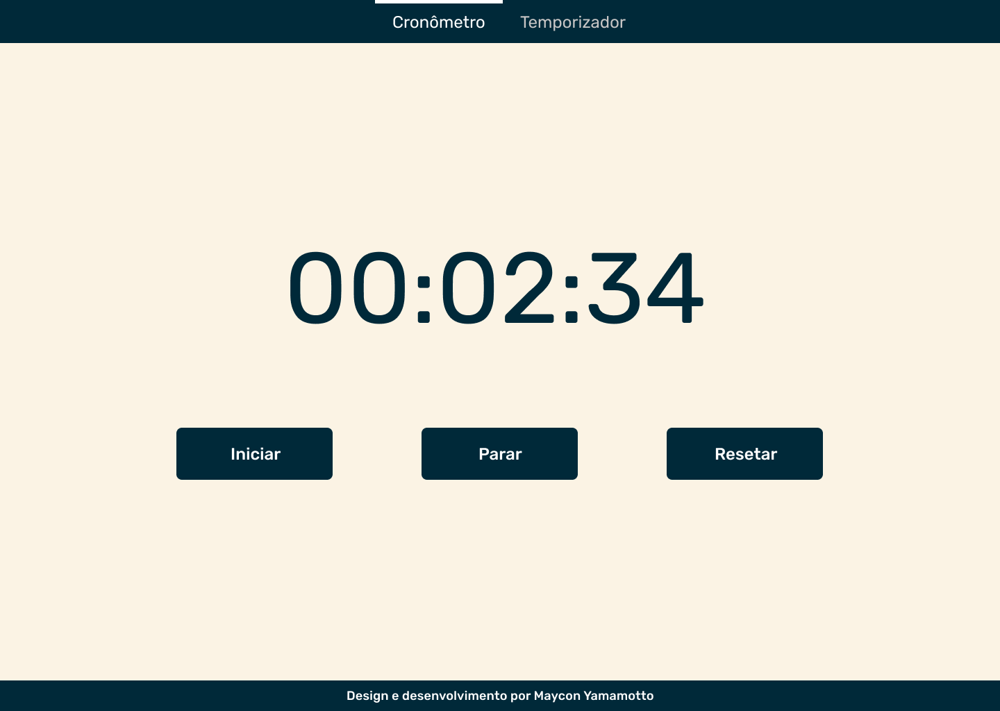

<h1 align="center">⏱️ <a href="#" alt="site cronômetro"> Cronômetro </a></h1>

<h3 align="center">
    Cronômetro para marcar intervalos de tempo
</h3>

<h4 align="center">
  🛠️ Pendente 🧑‍🔧🛠️
</h4>

Tabela de conteúdos
=================
<!--ts-->
   * [Sobre o projeto](#-sobre-o-projeto)
   * [Funcionalidades](#-funcionalidades)
   * [Layout](#-layout)
     * [Mobile](#mobile)
     * [Web](#web)
   * [Tecnologias](#-tecnologias)
     * [WebSite](#user-content-Website)
     * [Utilitários](#user-content-Utilitários)
   * [Autor](#-autor)
   * [Licença](#user-content--licença)
<!--te-->

## 💻 Sobre o projeto

⏱️ Cronômetro - é um projeto pessoal para praticar meu conhecimento em javascript.

---

## ⚙️ Funcionalidades

- [x] Usuário podem usar:
  - [x] cronômetro
  - [ ] temporizador 
  - [ ] salvar o tempo do cronômetro
  - [ ] compartilhar nas redes sociais o seu tempo
  - [ ] site responsivo para mobile

---

## 🎨 Layout

O layout da aplicação está disponível no Figma:

### Mobile

  Em desenvolvimento

### Web

  

---

## 🛠 Tecnologias

As seguintes ferramentas foram usadas na construção do projeto:

#### **Website**

-   **[Html]**
-   **[Sass]**
-   **[Javascript]**

#### **Utilitários**

-   Protótipo:  **[Figma](https://www.figma.com/)**  →  **[Protótipo (Cronômetro)](https://www.figma.com/file/QHsxpeiCI2rHNbCsxIu96h/Cronometro?node-id=0%3A1)**
-   Editor:  **[Visual Studio Code](https://code.visualstudio.com/)**
-   Commit:  **[Sourcetree](https://www.sourcetreeapp.com/)**
-   Fontes:  **[Rubik](https://fonts.google.com/specimen/Rubik)**

---

## 🦸 Autor

<a href="https://www.linkedin.com/in/mayconyamamotto/">
 
  
 <b>Maycon Yamamotto</b></a></a>
  
 
---

## 📝 Licença

Feito com ❤️ por Maycon Yamamotto 👋🏽 [Entre em contato!](https://www.linkedin.com/in/mayconyamamotto/)

---
